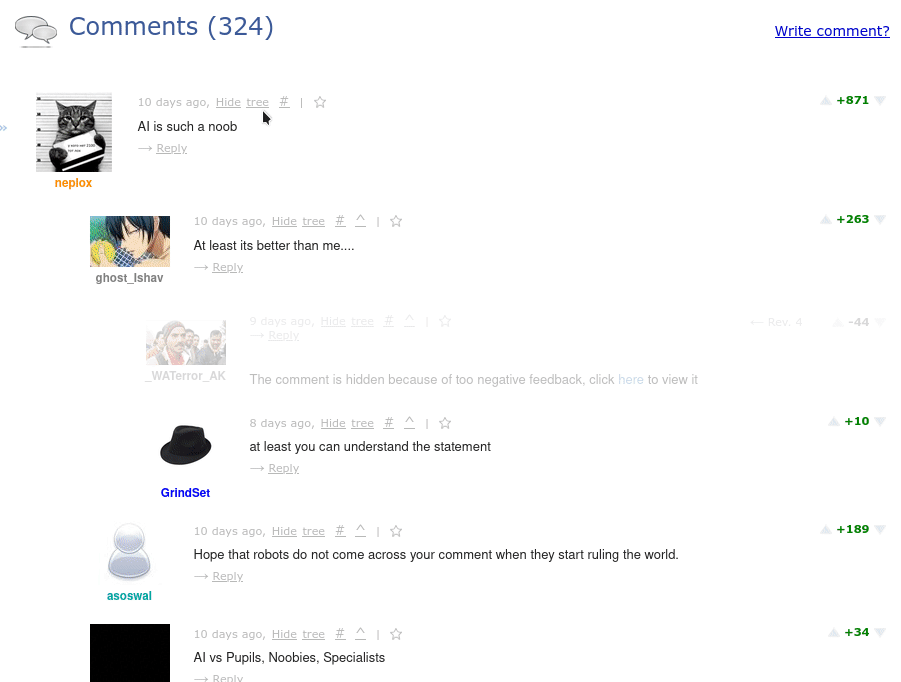

# Userscripts

These directory houses a few useful userscripts. To install them, a userscript manager like [Violentmonkey](https://violentmonkey.github.io/) will be needed.

### Suppress CodeChef confirmation dialogs

[Install]()

### Show/Hide Codeforces comment trees

[Install]()

#### Features

- Allows you to hide a single comment or the entire comment tree.
- Saves the hidden comment/tree, so the next time you visit the blog, it is automatically hidden.

